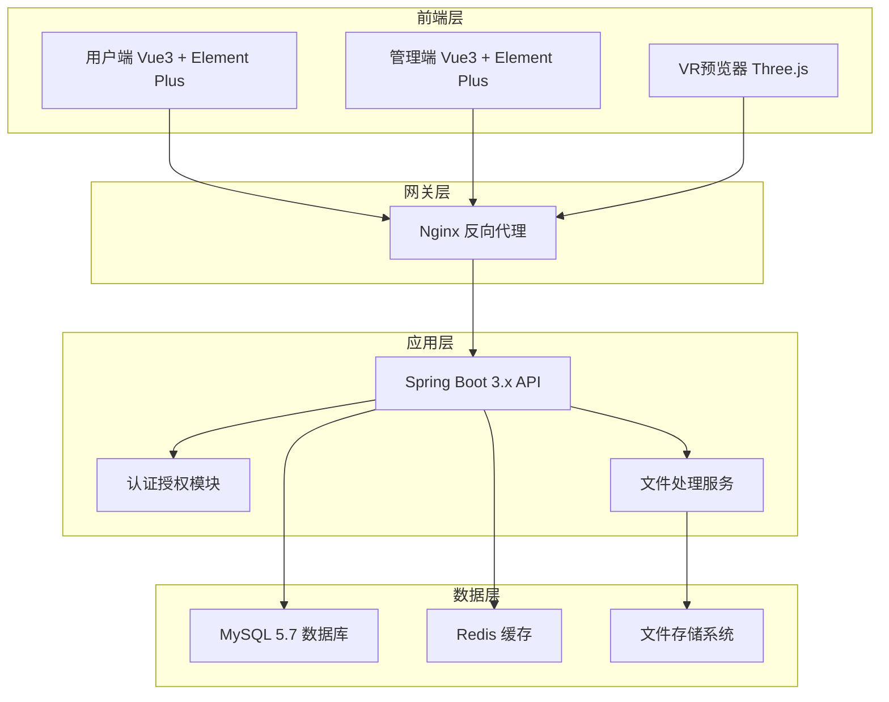
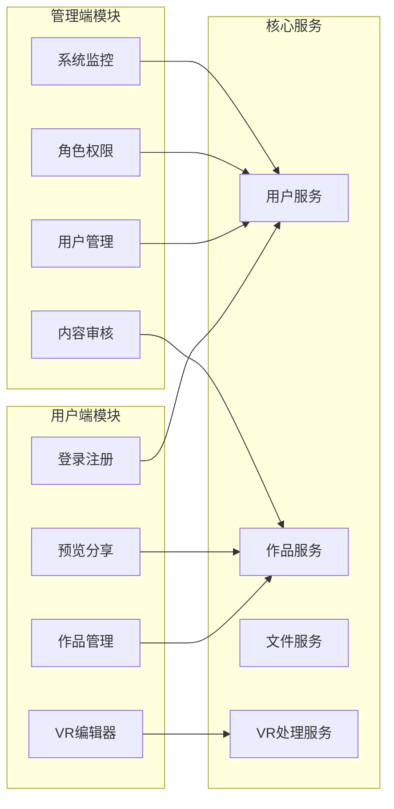
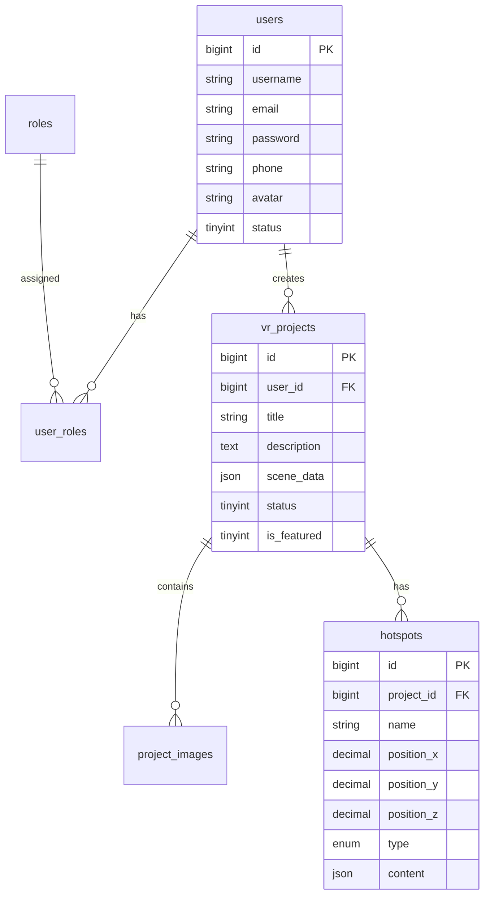
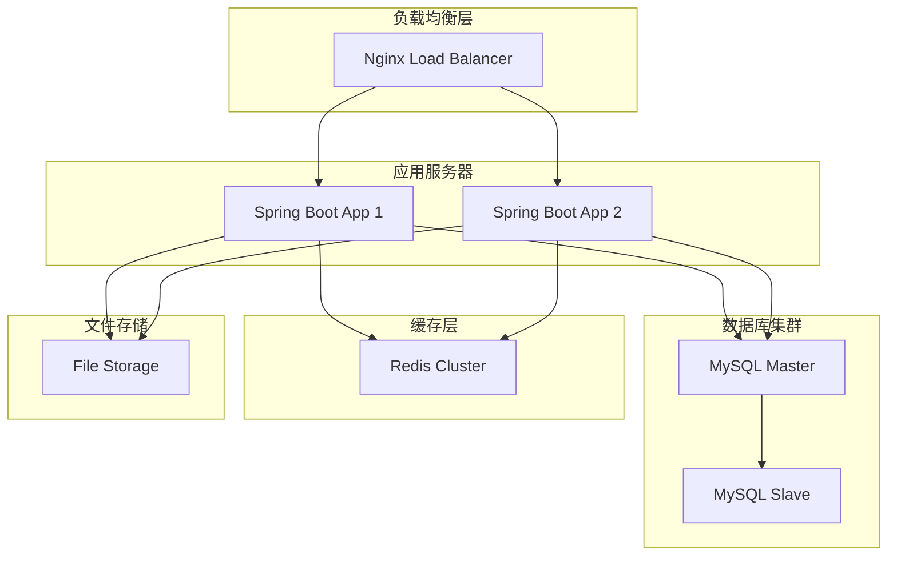

# HappyVR平台设计文档

## 概述

HappyVR平台是一个基于Web的VR全景编辑和预览系统，采用前后端分离架构。系统支持用户上传图片生成VR全景，提供在线编辑热点功能，并包含完整的用户管理和内容管理功能。

### 技术栈选择
- **后端**: Spring Boot 3.x + MySQL 5.7 + JDK 21
- **前端**: Vue 3 + Element Plus + Three.js/A-Frame
- **VR渲染**: Three.js + WebGL
- **文件存储**: 本地存储 + 云存储（可选）
- **图片处理**: ImageMagick + 自定义全景拼接算法

## 架构设计

### 系统架构图



### 模块架构



## 组件和接口设计

### 前端组件架构

#### 用户端组件结构
```
src/
├── views/
│   ├── auth/
│   │   ├── Login.vue
│   │   └── Register.vue
│   ├── dashboard/
│   │   ├── ProjectList.vue
│   │   └── ProjectCard.vue
│   ├── editor/
│   │   ├── VREditor.vue
│   │   ├── HotspotPanel.vue
│   │   └── MediaUpload.vue
│   └── preview/
│       ├── VRViewer.vue
│       └── ShareModal.vue
├── components/
│   ├── common/
│   │   ├── Header.vue
│   │   ├── Sidebar.vue
│   │   └── Loading.vue
│   └── vr/
│       ├── VRScene.vue
│       ├── HotspotMarker.vue
│       └── ControlPanel.vue
└── utils/
    ├── vrEngine.js
    ├── fileUpload.js
    └── api.js
```

#### 管理端组件结构
```
src/
├── views/
│   ├── user/
│   │   ├── UserList.vue
│   │   └── UserDetail.vue
│   ├── role/
│   │   ├── RoleList.vue
│   │   └── PermissionTree.vue
│   ├── content/
│   │   ├── ProjectManage.vue
│   │   └── AuditPanel.vue
│   └── system/
│       ├── SystemConfig.vue
│       └── OperationLog.vue
└── components/
    ├── layout/
    │   ├── AdminLayout.vue
    │   └── AdminHeader.vue
    └── charts/
        └── StatisticsChart.vue
```

### 后端服务架构

#### 控制器层 (Controller)
```java
@RestController
@RequestMapping("/api/v1")
public class ProjectController {
    // 项目CRUD操作
    // VR生成接口
    // 热点管理接口
}

@RestController
@RequestMapping("/api/v1/admin")
public class AdminController {
    // 用户管理
    // 内容审核
    // 系统配置
}
```

#### 服务层 (Service)
```java
@Service
public class VRProcessingService {
    // 图片处理和VR生成
    // 热点数据处理
    // 预览链接生成
}

@Service
public class UserService {
    // 用户认证授权
    // 角色权限管理
}
```

### API接口设计

#### 用户端核心接口

**项目管理接口**
```
POST   /api/v1/projects              创建VR项目
GET    /api/v1/projects              获取用户项目列表
GET    /api/v1/projects/{id}         获取项目详情
PUT    /api/v1/projects/{id}         更新项目信息
DELETE /api/v1/projects/{id}         删除项目
```

**文件上传接口**
```
POST   /api/v1/upload/images         批量上传图片
POST   /api/v1/upload/media          上传媒体文件
GET    /api/v1/upload/progress/{id}  获取处理进度
```

**VR处理接口**
```
POST   /api/v1/vr/generate           生成VR全景
POST   /api/v1/vr/hotspots           添加热点
PUT    /api/v1/vr/hotspots/{id}      更新热点
DELETE /api/v1/vr/hotspots/{id}      删除热点
```

#### 管理端接口

**用户管理接口**
```
GET    /api/v1/admin/users           获取用户列表
POST   /api/v1/admin/users           创建用户
PUT    /api/v1/admin/users/{id}      更新用户
DELETE /api/v1/admin/users/{id}      删除用户
```

**内容管理接口**
```
GET    /api/v1/admin/projects        获取所有项目
PUT    /api/v1/admin/projects/{id}/status  审核项目
PUT    /api/v1/admin/projects/{id}/featured 设置推荐
```

## 数据模型设计

### 核心数据表结构

#### 用户表 (users)
```sql
CREATE TABLE users (
    id BIGINT PRIMARY KEY AUTO_INCREMENT,
    username VARCHAR(50) UNIQUE NOT NULL,
    email VARCHAR(100) UNIQUE NOT NULL,
    password VARCHAR(255) NOT NULL,
    phone VARCHAR(20),
    avatar VARCHAR(255),
    status TINYINT DEFAULT 1 COMMENT '1:启用 0:禁用',
    created_at TIMESTAMP DEFAULT CURRENT_TIMESTAMP,
    updated_at TIMESTAMP DEFAULT CURRENT_TIMESTAMP ON UPDATE CURRENT_TIMESTAMP
);
```

#### 角色表 (roles)
```sql
CREATE TABLE roles (
    id BIGINT PRIMARY KEY AUTO_INCREMENT,
    name VARCHAR(50) NOT NULL,
    description VARCHAR(200),
    permissions JSON,
    created_at TIMESTAMP DEFAULT CURRENT_TIMESTAMP
);
```

#### 用户角色关联表 (user_roles)
```sql
CREATE TABLE user_roles (
    user_id BIGINT,
    role_id BIGINT,
    PRIMARY KEY (user_id, role_id),
    FOREIGN KEY (user_id) REFERENCES users(id),
    FOREIGN KEY (role_id) REFERENCES roles(id)
);
```

#### VR项目表 (vr_projects)
```sql
CREATE TABLE vr_projects (
    id BIGINT PRIMARY KEY AUTO_INCREMENT,
    user_id BIGINT NOT NULL,
    title VARCHAR(200) NOT NULL,
    description TEXT,
    cover_image VARCHAR(255),
    scene_data JSON COMMENT 'VR场景配置数据',
    status TINYINT DEFAULT 0 COMMENT '0:草稿 1:已发布 2:审核中 3:已拒绝',
    is_featured TINYINT DEFAULT 0 COMMENT '是否推荐',
    view_count INT DEFAULT 0,
    share_token VARCHAR(32) UNIQUE,
    created_at TIMESTAMP DEFAULT CURRENT_TIMESTAMP,
    updated_at TIMESTAMP DEFAULT CURRENT_TIMESTAMP ON UPDATE CURRENT_TIMESTAMP,
    FOREIGN KEY (user_id) REFERENCES users(id)
);
```

#### 项目图片表 (project_images)
```sql
CREATE TABLE project_images (
    id BIGINT PRIMARY KEY AUTO_INCREMENT,
    project_id BIGINT NOT NULL,
    original_url VARCHAR(255) NOT NULL,
    processed_url VARCHAR(255),
    file_size BIGINT,
    width INT,
    height INT,
    sort_order INT DEFAULT 0,
    created_at TIMESTAMP DEFAULT CURRENT_TIMESTAMP,
    FOREIGN KEY (project_id) REFERENCES vr_projects(id) ON DELETE CASCADE
);
```

#### 热点表 (hotspots)
```sql
CREATE TABLE hotspots (
    id BIGINT PRIMARY KEY AUTO_INCREMENT,
    project_id BIGINT NOT NULL,
    name VARCHAR(100) NOT NULL,
    position_x DECIMAL(10,6) NOT NULL,
    position_y DECIMAL(10,6) NOT NULL,
    position_z DECIMAL(10,6) NOT NULL,
    type ENUM('info', 'media', 'link', 'audio') NOT NULL,
    content JSON COMMENT '热点内容配置',
    style JSON COMMENT '热点样式配置',
    created_at TIMESTAMP DEFAULT CURRENT_TIMESTAMP,
    FOREIGN KEY (project_id) REFERENCES vr_projects(id) ON DELETE CASCADE
);
```

#### 系统配置表 (system_configs)
```sql
CREATE TABLE system_configs (
    id BIGINT PRIMARY KEY AUTO_INCREMENT,
    config_key VARCHAR(100) UNIQUE NOT NULL,
    config_value TEXT,
    description VARCHAR(200),
    updated_at TIMESTAMP DEFAULT CURRENT_TIMESTAMP ON UPDATE CURRENT_TIMESTAMP
);
```

### 数据关系图



## VR渲染引擎设计

### Three.js VR场景架构

```javascript
class VRSceneManager {
    constructor(container) {
        this.container = container;
        this.scene = new THREE.Scene();
        this.camera = new THREE.PerspectiveCamera(75, window.innerWidth / window.innerHeight, 0.1, 1000);
        this.renderer = new THREE.WebGLRenderer({ antialias: true });
        this.controls = new THREE.OrbitControls(this.camera, this.renderer.domElement);
        this.hotspots = [];
        this.init();
    }
    
    init() {
        // 初始化渲染器
        this.renderer.setSize(window.innerWidth, window.innerHeight);
        this.renderer.setPixelRatio(window.devicePixelRatio);
        this.container.appendChild(this.renderer.domElement);
        
        // 设置相机控制
        this.controls.enableDamping = true;
        this.controls.dampingFactor = 0.05;
        this.controls.enableZoom = true;
        this.controls.enablePan = false;
        
        // 开始渲染循环
        this.animate();
    }
    
    loadPanorama(imageUrl) {
        const geometry = new THREE.SphereGeometry(500, 60, 40);
        geometry.scale(-1, 1, 1); // 内翻球体
        
        const texture = new THREE.TextureLoader().load(imageUrl);
        const material = new THREE.MeshBasicMaterial({ map: texture });
        
        const mesh = new THREE.Mesh(geometry, material);
        this.scene.add(mesh);
    }
    
    addHotspot(hotspotData) {
        const hotspot = new VRHotspot(hotspotData);
        this.hotspots.push(hotspot);
        this.scene.add(hotspot.mesh);
    }
    
    animate() {
        requestAnimationFrame(() => this.animate());
        this.controls.update();
        this.renderer.render(this.scene, this.camera);
    }
}

class VRHotspot {
    constructor(data) {
        this.data = data;
        this.createMesh();
        this.bindEvents();
    }
    
    createMesh() {
        const geometry = new THREE.SphereGeometry(2, 16, 16);
        const material = new THREE.MeshBasicMaterial({ 
            color: 0xffd700,
            transparent: true,
            opacity: 0.8
        });
        
        this.mesh = new THREE.Mesh(geometry, material);
        this.mesh.position.set(this.data.position_x, this.data.position_y, this.data.position_z);
        this.mesh.userData = this.data;
    }
    
    bindEvents() {
        this.mesh.onClick = () => {
            this.showContent();
        };
    }
    
    showContent() {
        // 显示热点内容弹框
        const content = JSON.parse(this.data.content);
        // 实现弹框显示逻辑
    }
}
```

## 错误处理设计

### 前端错误处理

```javascript
// 全局错误处理器
class ErrorHandler {
    static handle(error, context = '') {
        console.error(`[${context}] Error:`, error);
        
        if (error.response) {
            // HTTP错误
            const status = error.response.status;
            const message = error.response.data?.message || '请求失败';
            
            switch (status) {
                case 401:
                    this.handleAuthError();
                    break;
                case 403:
                    ElMessage.error('权限不足');
                    break;
                case 404:
                    ElMessage.error('资源不存在');
                    break;
                case 500:
                    ElMessage.error('服务器内部错误');
                    break;
                default:
                    ElMessage.error(message);
            }
        } else if (error.request) {
            // 网络错误
            ElMessage.error('网络连接失败，请检查网络设置');
        } else {
            // 其他错误
            ElMessage.error(error.message || '未知错误');
        }
    }
    
    static handleAuthError() {
        ElMessage.error('登录已过期，请重新登录');
        // 清除token并跳转到登录页
        localStorage.removeItem('token');
        router.push('/login');
    }
}
```

### 后端错误处理

```java
@ControllerAdvice
public class GlobalExceptionHandler {
    
    @ExceptionHandler(ValidationException.class)
    public ResponseEntity<ApiResponse> handleValidation(ValidationException e) {
        return ResponseEntity.badRequest()
            .body(ApiResponse.error("参数验证失败: " + e.getMessage()));
    }
    
    @ExceptionHandler(AuthenticationException.class)
    public ResponseEntity<ApiResponse> handleAuth(AuthenticationException e) {
        return ResponseEntity.status(HttpStatus.UNAUTHORIZED)
            .body(ApiResponse.error("认证失败"));
    }
    
    @ExceptionHandler(FileProcessingException.class)
    public ResponseEntity<ApiResponse> handleFileProcessing(FileProcessingException e) {
        return ResponseEntity.status(HttpStatus.INTERNAL_SERVER_ERROR)
            .body(ApiResponse.error("文件处理失败: " + e.getMessage()));
    }
    
    @ExceptionHandler(Exception.class)
    public ResponseEntity<ApiResponse> handleGeneral(Exception e) {
        log.error("Unexpected error", e);
        return ResponseEntity.status(HttpStatus.INTERNAL_SERVER_ERROR)
            .body(ApiResponse.error("系统内部错误"));
    }
}
```

## 测试策略

### 前端测试

**单元测试 (Jest + Vue Test Utils)**
- 组件渲染测试
- 用户交互测试
- VR场景功能测试
- 工具函数测试

**集成测试 (Cypress)**
- 用户注册登录流程
- VR项目创建和编辑流程
- 热点添加和配置流程
- 管理端功能测试

### 后端测试

**单元测试 (JUnit 5 + Mockito)**
- Service层业务逻辑测试
- Repository层数据访问测试
- 工具类和算法测试

**集成测试 (Spring Boot Test)**
- API接口测试
- 数据库操作测试
- 文件上传和处理测试

**性能测试 (JMeter)**
- 并发用户访问测试
- VR生成性能测试
- 数据库查询性能测试

### 测试数据准备

```sql
-- 测试用户数据
INSERT INTO users (username, email, password) VALUES 
('testuser1', 'test1@example.com', '$2a$10$encrypted_password'),
('testuser2', 'test2@example.com', '$2a$10$encrypted_password');

-- 测试角色数据
INSERT INTO roles (name, description, permissions) VALUES 
('USER', '普通用户', '["project:create", "project:edit"]'),
('ADMIN', '管理员', '["*"]');

-- 测试项目数据
INSERT INTO vr_projects (user_id, title, description, status) VALUES 
(1, '测试VR项目', '这是一个测试项目', 1);
```

## 部署和运维

### 部署架构



### 监控和日志

**应用监控**
- Spring Boot Actuator健康检查
- 自定义业务指标监控
- JVM性能监控

**日志管理**
- 结构化日志输出
- 日志级别动态调整
- 错误日志告警

**性能优化**
- 数据库查询优化
- 图片处理异步化
- CDN加速静态资源